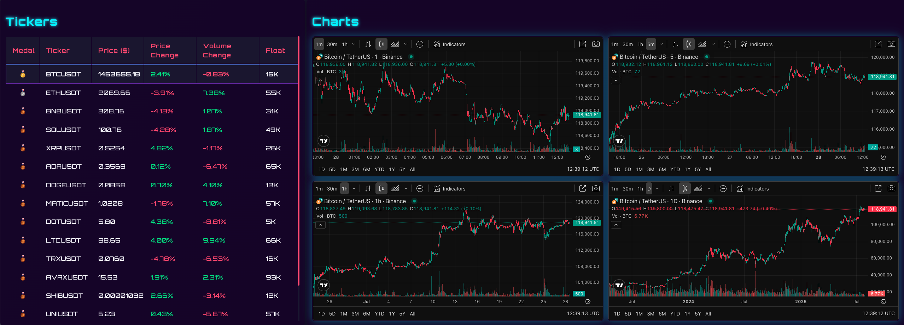

# Momentum Scanner

## Overview

Momentum Scanner is a powerful cryptocurrency analysis tool designed to detect and identify cryptocurrencies with strong incoming momentum. The platform provides real-time scanning capabilities to help traders and investors identify potentially profitable trading opportunities in the volatile cryptocurrency market.

## Features

### Real-time Ticker Analysis

- **Live Price Monitoring**: Track cryptocurrency prices in real-time across major exchanges
- **Momentum Detection**: Advanced algorithms to identify cryptocurrencies with strong upward or downward momentum
- **Volume Analysis**: Monitor trading volume changes to gauge market interest
- **Price Change Tracking**: Real-time percentage changes with color-coded indicators

### Multi-timeframe Chart Analysis

- **Multiple Timeframes**: View price action across 1-minute, 5-minute, 1-hour, and daily intervals
- **Candlestick Patterns**: Professional charting with green/red candlesticks for price movements
- **Volume Indicators**: Volume bars to confirm price movements
- **Technical Analysis**: Built-in indicators and charting tools

### User-friendly Interface

- **Dark Theme**: Easy on the eyes with blue and purple accents
- **Responsive Design**: Works seamlessly across desktop and mobile devices
- **Intuitive Layout**: Clear separation between ticker data and chart analysis
- **Real-time Updates**: Live data refresh without page reloads

## Supported Cryptocurrencies

The platform currently supports major cryptocurrencies including:

- Bitcoin (BTC)
- Ethereum (ETH)
- Binance Coin (BNB)
- Solana (SOL)
- Ripple (XRP)
- Cardano (ADA)
- Dogecoin (DOGE)
- Polygon (MATIC)
- Polkadot (DOT)
- Litecoin (LTC)
- Tron (TRX)
- Avalanche (AVAX)
- Shiba Inu (SHIB)
- Uniswap (UNI)
- ... and more !

## Technology Stack

- **Frontend**: React + TypeScript + Vite
- **Real-time Data**: WebSocket connections for live market data
- **Charting**: Professional trading chart components
- **Styling**: Modern CSS with responsive design
- **State Management**: React hooks for efficient data handling

## Getting Started

1. Clone the repository
2. Install dependencies: `npm install`
3. Start the development server: `npm run dev`
4. Open your browser and navigate to the application

## Usage

1. **Monitor Tickers**: View the left panel to see all supported cryptocurrencies with their current prices, changes, and volume data
2. **Analyze Charts**: Use the right panel to examine detailed price charts across different timeframes
3. **Identify Momentum**: Look for cryptocurrencies showing strong price movements and volume increases
4. **Make Informed Decisions**: Use the comprehensive data to make trading decisions

## Disclaimer

This tool is for educational and informational purposes only. Cryptocurrency trading involves significant risk, and past performance does not guarantee future results. Always conduct your own research and consider consulting with financial advisors before making investment decisions.

## Contributing

We welcome contributions! Please feel free to submit issues, feature requests, or pull requests to help improve the Momentum Scanner.

## License

This project is licensed under the MIT License - see the LICENSE file for details.
